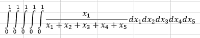

### 15.02.2023

**Баллы**: 6 / 6.

**Дедлайн**: 15.03.2023

**Задача**: Существуют две лаборатории по производству вакцины: A и B. Вакцина производится за n этапов, каждый этап у
каждой лаборатории занимает определенное время. Существует возможность перевоза полуфабриката из одной лаборатории в
другую за определенное время (зависит от этапа производства и направления доставки). Определите минимальное количество
времени на производство вакцины и траекторию производства этой вакцины. Решение — код. Входные данных: время
производства каждого этапа в лаборатории A, время производства каждого этапа в лаборатории B, время доставки из A и B на
каждом этапе, время доставки из B и A на каждом этапе. (если этапов n, то всего входных чисел 4n - 2 (доставка на n-ом
этапе бесполезна)).

***

**Баллы**: 10 / 10.

**Дедлайн**: 29.03.2023

**Задача**: Даны N-этажное здание и k стеклянных шаров. Начиная с определенного этажа, шары могут разбиться (а могут и
не разбиться, если N этажей недостаточно). Если один шар разбился, то у Вас осталось на один шар меньше 🙂. Определить
минимальное количество бросков этих шаров с различных этажей, чтобы гарантированно определить, начиная с какого этажа,
шары бьются. При этом нужно написать алгоритм выбора этажа на каждом броске. Решение — код. Входные данные: N и k, при
k > 2. Код должен работать на числах, равных гуголу (единица и 100 нулей).

**Пример**:

- Входные данные: N = 5, k = 2 (в задаче k должно быть больше 2)
- Ответ алгоритма: Потребуется 3 броска, начните с 3-го этажа
- Ваше сообщение: Разбился
- Ответ алгоритма: Киньте с 1-ого этажа
- Ваше сообщение: Не разбился
- Ответ алгоритма: Киньте со 2-го этажа
- Ваше сообщение: Не разбился
- Ответ алгоритма: Начинают биться с 3-го этажа.

**Баллы**: ? / 10.

**Дополнительная задача**: Проанализировать и вывести явную формулу для определения N(t, k) — максимальной этажность
дома, для которого можно определить, начиная с какого этажа шарики разбиваются, сделав t бросаний. Вспомните треугольник
Паскаля.

_И по поводу параметров задачи, гугол... Я не уточнил, это для нескольких десятков шариков. В общем случае количество
этажей n не превышает (10000^k)*k!, но не больше гугола (это техническое некрасивое ограничение нужно, чтоб таблица
динамического программирования влезала в оперативку). Хотя с использованием **Дополнительной задачи** можно, насколько я
знаю, решить и для любых n и k в пределах гугола. Но тогда это потребует не только динамического программирования и
задача становится намного сложнее._

***

**Баллы**: 5 / 5

**Дедлайн**: 15.03.2023

**Задача**: Даны 2 последовательности. Нужно найти **Наибольшую Общую Подпоследовательность (НОП)**. Нужно вывести длину
НОП и саму НОП. Решение — код. Входные данные: 2 последовательности.

**Наибольшая Общая Подпоследовательность (НОП)** — подпоследовательность максимальной длины, которая есть в обеих
последовательностях. Элементы подпоследовательности в самих последовательностях идут в том же порядке, но
**необязательно** идут подряд.

**Пример**:

- Входные данные: УНИВЕРСИТЕТ УНИКС
- Ответ: 4 УНИС

В примере видно, что

- 'У' идёт до 'Н'
- 'Н' идёт до 'И'
- 'И' идёт до 'С'.

Также 'УНИС' идет в словах не подряд, между 'И' и 'С' есть 'ВЕР' и 'К', соответственно.

***

**Баллы**: 3.5 / 3.5.

**Дедлайн**: 15.03.2023

**Задача**: Дана последовательность. Нужно найти **Наибольшую Возрастающую Подпоследовательность (НВП)**. Можно
основываться на решении предыдущей задачи. Решение — код. Входные данные: Последовательность.

**Наибольшая Возрастающая Подпоследовательность (НВП)** — подпоследовательность максимальной длины, где элементы идут в
таком же, как и в последовательности, но **необязательно** идут подряд. Причём каждый следующий элемент
подпоследовательности **больше** предыдущего. Если взять **Наибольшую Неубывающую Подпоследовательность**, то каждый
следующий элемент подпоследовательности **не меньше** предыдущего.

**Пример**:

- Входные данные: 20 29 21 6 11 10 20 6 21
- Ответ:
    - 4
    - 6 10 20 21

**ИЛИ**

- Ответ:
    - 4
    - 6 11 20 21

***

### 22.02.2023

**Баллы**: ? / 10.

**Дополнительные баллы**: ? / 4.

**Дедлайн**: 22.03.2023

**Задача**: Дано N-ное количество матриц, необязательно квадратных. Для каждой i-ой матрицы заданы не значения матрицы,
а только размер (n_i; m_i). Эти матрицы перемножаются друг с другом и это гарантируется. То есть для каждого i
от 1 до 99 действительно то, что m_i = n_i+1. От расстановок скобок во время умножения матриц результат не изменится,
а вот количество поэлементных умножений — изменится. Основная задача: определить наименьшее количество поэлементных
умножений при наилучшей расстановки скобок. Решение — код. Входные данные: число матриц N, и N штук их размеров
(n_i; m_i).

**Дополнительная задача**: Вывести эту расстановку скобок, чтобы знать, как надо умножать матрицы.

***

**Баллы**: ? / 23.

**Дополнительные баллы**: ? / 16.

**Дедлайн**: Бессрочно

**Задача**: Задано число N < 16 — количество прямоугольных деталей со сторонами (a_i; b_i), где i от 1 до N.
Размеры деталей целые, положительные и не больше 100 условных единиц. Эти детали размещают на прямоугольном листе так,
что их стороны параллельны сторонам листа и детали не накладываются друг на друга. Причем эти детали можно вырезать из
листа гильотинными разрезами. Необходимо написать программу, которая сгенерируют массив, позволяющий после его
формирования отвечать на вопрос для любого прямоугольного листа размера A на B:
"Возможно на нем хоть какое-то гильотинное размещение деталей?".
При готовом массиве время ответа O(N). **Основная задача** — составить этот массив.

_Гильотина режет исходный лист и всякие его части, которые получаются разрезами, только от края до края этих частей._

**Дополнительная задача**: Необходимо восстановить то, как можно разместить детали, чтобы получилось
гильотинное размещение деталей. Возможны дополнительные баллы за графическое оформление.

***

### 01.03.2023

**Баллы**: ? / 4.

**Дедлайн**: 29.03.2023

**Задача**: Задаётся число N. Нужно найти значение N-мерного интеграла, где каждая переменная от 0 до 1.
Сам интеграл выглядит для N = 5 выглядит следующим образом:

Решить нужно с помощью рандомизированного алгоритма.

***

**Баллы**: ? / 6.

**Дедлайн**: 29.03.2023

**Задача**: Реализовать алгоритм теста Миллера-Рабина.

***

**Баллы**: ? / 3.5.

**Дедлайн**: 29.03.2023

**Задача**: Дан массив данных длины n, неотсортированный.
За O(n) найти r-ый элемент в отсортированном виде этого массива.

***

**Баллы**: ? / 2.5 >> 2 >> 1.5.

**Дедлайн**: 29.03.2023

**Задача**: Заданы 10 миллионов элементов, в нем есть повторения. Причем одно число встречается аж 6 миллионов раз.
Нужно за 200 операций определить это число, которое встречается 6 миллионов раз.

_Одна операция — просмотр i-ого элемента в массиве._

***

### 15.03.2023

**Баллы**: ? / 8.

**Дедлайн**: Бессрочно

**Задача**: реализовать алгоритм Каргера.

***

**Баллы**: ? / 7.

**Дедлайн**: Бессрочно

**Задача**: реализовать алгоритм Штейна.

***

**Баллы**: ? / 60.

**Дедлайн**: 17.05.2023

**Задача**: Даны n ~ 10000 - 100000 трапеций. У них постоянная высота h. Нужно разместить их на полосе высотой h так,
чтобы они поместились все, друг на друга не накладывались, а длина полосы была минимальной. Трапецию можно вращать 
на 180 градусов. А можно и не вращать. А можно и отзеркалить)). Принимаются разные варианты, 
главное 100% правильное решение задачи.

***
***
